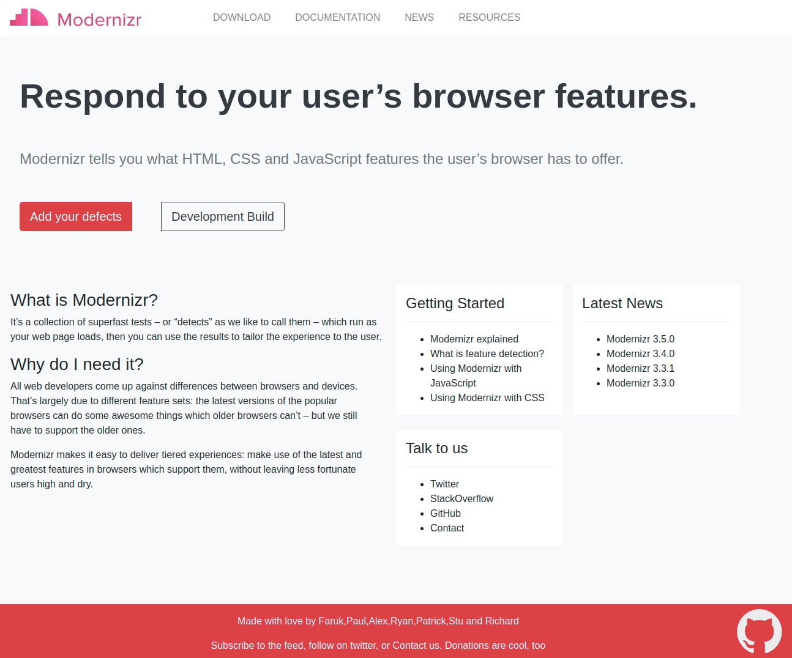
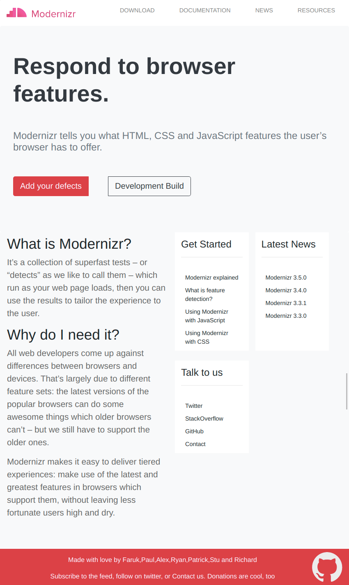
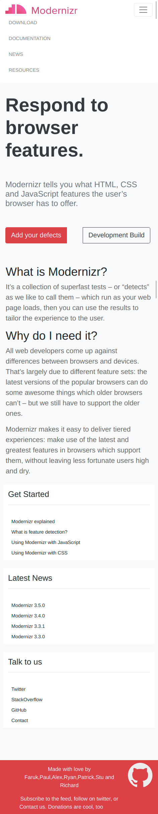

## Column Drop Pattern Challenge

## Context

Responsive Design patterns are used to make a web page responsive across various devices of varying screen sizes.Most design patterns will use breakpoints to adapt for different screen sizes. A Breakpoint is the point at which a different CSS will be applied, usually through a media query, to optimize the design for the user’s viewport. A good example of a breakpoint would be one where your layout has to change from two columns to four columns from one device to another.

For full-width multi-column layouts, column drop simply stacks the columns vertically as the window width becomes too narrow for the content.

Eventually this results in all of the columns being stacked vertically. Choosing breakpoints for this layout pattern is dependent on the content and changes for each design.

## Problem Statement

Create a Web Page which resembles the images below following Column drop pattern using Bootstrap framework.

### Desktop Image


### Tab Image


### Mobile Image




### Details
1. All the assets required can be found in the `./assets` folder
2. Few texts which have been used in the web page
```
Modernizr tells you what HTML, CSS and JavaScript features the user’s browser has to offer.

Add your defects

Development Build

What is Modernizr?

It’s a collection of superfast tests – or “detects” as we like to call them – which run as your web page loads, then you can use the results to tailor the experience to the user.
Why do I need it?

All web developers come up against differences between browsers and devices. That’s largely due to different feature sets: the latest versions of the popular browsers can do some awesome things which older browsers can’t – but we still have to support the older ones.

Modernizr makes it easy to deliver tiered experiences: make use of the latest and greatest features in browsers which support them, without leaving less fortunate users high and dry.

Modernizr explained

What is feature detection? 

Using Modernizr with JavaScript 

Using Modernizr with CSS
Modernizr 3.5.0
Modernizr 3.4.0
Modernizr 3.3.1
Modernizr 3.3.0

Made with love by Faruk,Paul,Alex,Ryan,Patrick,Stu and Richard
Subscribe to the feed, follow on twitter, or Contact us.

Donations are cool, too
```

## Instructions
1. Download and unzip the boilerplate code.
2. Run the command `npm install` to install the dependencies required for automated testing.
3. Open the boilerplate code in VSCode to develop the assignment solution.
4. Add required code in the `index.html` file and create external CSS file to style the web page.
5. First, test the solution locally by running the command `npm run test`.
6. Refactor the solution to ensure all test cases are passing.
7. DO NOT MODIFY THE PROVIDED CODE, ELSE THIS MAY IMPACT THE TEST CODE EXECUTION.
8. Zip the solution code by selecting all the files and folders **excluding** the `node_modules` folder and give the name same as assignment name to the zipped file.
9. Upload the zipped solution for submission.