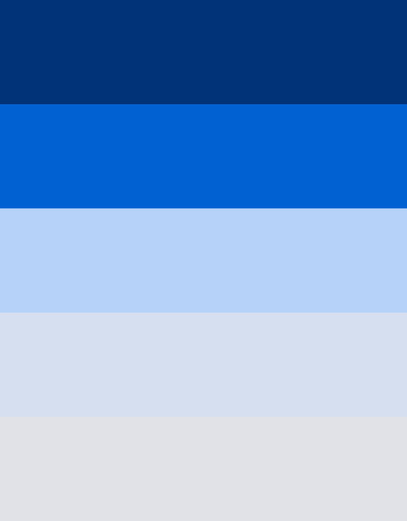

## Mostly Fluid Pattern Challenge

## Context

Responsive Design patterns are used to make a web page responsive across various devices of varying screen sizes.Most design patterns will use breakpoints to adapt for different screen sizes. A Breakpoint is the point at which a different CSS will be applied, usually through a media query, to optimize the design for the user’s viewport. A good example of a breakpoint would be one where your layout has to change from two columns to four columns from one device to another.

In "Mostly Fluid" Pattern, the core structure of the layout really doesn't change until the smallest screen width. Instead, the design mostly relies on fluid grids to adapt to a variety of screen sizes.

On large or medium screens, it usually remains the same size, simply adjusting the margins on wider screens.On smaller screens, the fluid grid causes the main content to reflow, while columns are stacked vertically. One major advantage of this pattern is that it usually only requires one breakpoint between small screens and large screens.

## Problem Statement

Create a Web Page which resembles the images below which is mostly fluid in responsiveness to a variety of screen sizes using Mostly Fluid Pattern.

### Desktop Image

### Tab Image

### Mobile Image

### Details
1. All the assets required can be found in the `./assets` folder

## Instructions
1. Download and unzip the boilerplate code.
2. Run the command `npm install` to install the dependencies required for automated testing.
3. Open the boilerplate code in VSCode to develop the assignment solution.
4. Add required code in the `index.html` file and create external CSS file to style the web page.
5. First, test the solution locally by running the command `npm run test`.
6. Refactor the solution to ensure all test cases are passing.
7. DO NOT MODIFY THE PROVIDED CODE, ELSE THIS MAY IMPACT THE TEST CODE EXECUTION.
8. Zip the solution code by selecting all the files and folders **excluding** the `node_modules` folder and give the name same as assignment name to the zipped file.
9. Upload the zipped solution for submission.