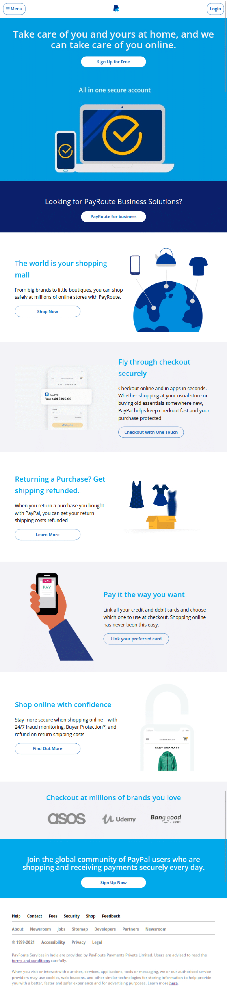
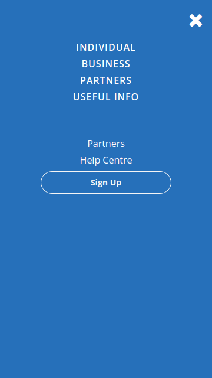
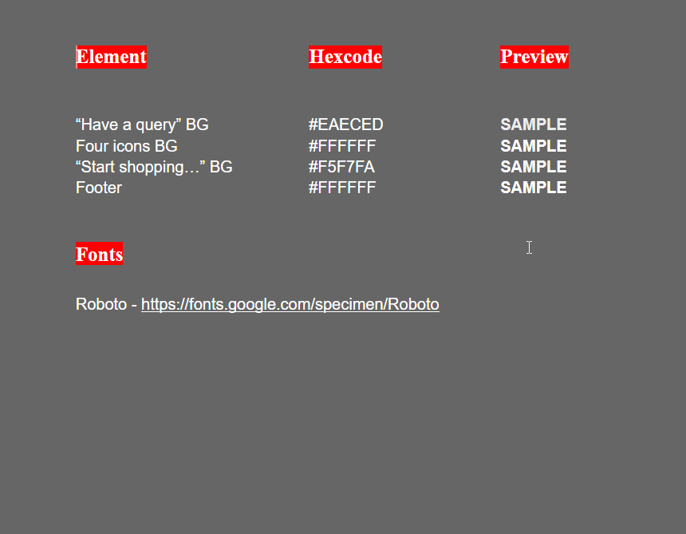

# PayRoute Challenge

## Context

You are a Front end developer at PayRoute, a business organization which enables customers to shop online easier, faster and safer.

The Organization already has a web site to enable online shopping for individuals and Website payments, B2B Payments for business. Now, the Sales and Marketing Unit wants this web site to be more responsive on all web devices to reach a wider audience. The Organization's goal is to double the online customers in the next 2 years. Hence, it is very keen on making the information available in the best possible way so that the information is **well presented and organized** on all web devices.​

As a Frontend Developer, you would have to create a **Responsive** Web Page to showcase all the services by laying out information in a way that is quickly usable and readable to help PayRoute reach a wider audience.

### Facts
1. According to a survey, 831 million millennials representing one quarter of the world’s population
2. Each millennial spends around 7.2 hours each day using different websites and mobile applications.
3. On an average these Millennials spend around 12 seconds each page. 
4. Google shares that a new user spends only 3 seconds on a site to find what he wants, and hops on to another.
5. In 2020, Worldwide Mobile market share was 55.73% whereas Desktop market share was 41.46% and Tablet market share was 2.81%.
6. Google says that more than 50.81% of global website traffic is on mobile devices 
7. In the last 5 years alone, the number of mobile phone users worldwide has gone up nearly one billion, from 4.1 billion to 4.93

## Problem Statement

**Create a Responsive Web Page which resembles the images below for customers to shop and pay faster, safer and easier**

**Desktop View**


**Tablet View**



**Mobile View**


**Mobile Menu Navigation View**




### Details
1. The assets required for building the webpage can be found in the `./assets` folders.
2. There is one font which is widely used across the page
    1. **Roboto** 
3. There are few colors which is widely used across the page.
    

4. Few texts which have been used on the page.
```
PAY WITH PAYROUTE.
SAFE HAI.

Wherever you shop online worldwide, a PayRoute account lets you check out safer, faster and easier. That’s why we are accepted in over 200 markets and trusted by over 346 million accounts.​

Looking for PayRoute for your business?
Go to Business Solutions.

Have a query? Click here to reach Help Centre

The safer, easier way to pay around the world.​

180-Day Buyer Protection
Item not as described? You have our first-of-its-kind 180-day refund window to get a full refund on your purchase.

One Account for shopping worldwide​
Shop globally with one PayPal account.​

Skip the Logins
Check out faster and easier with One Touch™ and you'll never need to enter your login details again.

Worry-free Shopping
Shop with ease and confidence. Your financial details are never shared, not even with the seller.

Start shopping with PayRoute today.
For more about PayRoute for your business or freelance needs,
go to PayRoute Business.

All trademarks, service marks, trade names and logos appearing on the site are the property of the respective owners.

PayRoute Services in India are provided by PayRoute Payments Private Limited (CIN U74990MH2009PTC194653). Users are advised to read the terms and conditions carefully.

When you visit or interact with our sites, services, applications, tools or messaging, we or our authorised service providers may use cookies, web beacons, and other similar technologies for storing information to help provide you with a better, faster and safer experience and for advertising purposes. Learn more here.

About BlogJobs Sitemap Developers Partners Newsroom 
©1999–2021 Accessibility Privacy Legal
```
## Instructions
1. Download and unzip the boilerplate code.
2. Run the command `npm install` to install the dependencies required for automated testing.
3. Open the boilerplate code in VSCode to develop the assignment solution.
4. Add required code in the `index.html` file and create external CSS file to style the web page.
5. First, test the solution locally by running the command `npm run test`.
6. Refactor the solution to ensure all test cases are passing.
7. DO NOT MODIFY THE PROVIDED CODE, ELSE THIS MAY IMPACT THE TEST CODE EXECUTION.
8. Zip the solution code by selecting all the files and folders **excluding** the `node_modules` folder and give the name same as assignment name to the zipped file.
9. Upload the zipped solution for submission.


